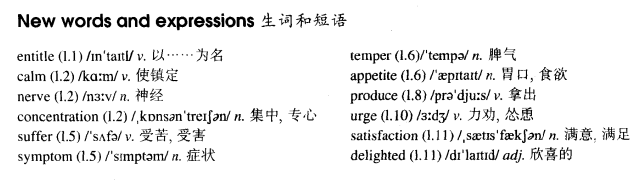

# Lesson 78

## Words

- entitle calm nerve concentration suffer symptom temper appetite produce urge satisfaction delighted enormous

- 

## The last one?

```
After reading an article entitled 'Cigarette Smoking and Your Health' I lit a cigarette to calm my nerves. I smoked with concentration and pleasure as I was sure that this would be my last cigarette.

For a whole week I did not smoke at all and during this time, my wife suffered terribly. I had all the usual symptoms of someone giving up smoking: a bad temper and an enormous appetite.

My friends kept on offering me cigarettes and cigars. They made no effort to hide their amusement whenever I produced a packet of sweets from my pocket.

After seven days of this I went to a party. Everybody around me was smoking and I felt extremely uncomfortable.

When my old friend Brian urged me to accept a cigarette, it was more than I could bear. I took one guiltily, lit it and smoked with satisfaction.

My wife was delighted that things had returned to normal once more. Anyway, as Brian pointed out, it is the easiest thing in the world to give up smoking. He himself has done it lots of times!
```

## Questions

1. `He himself has done it lots of times` 中的 `he himself`

## Whole

1. `entitle sb. to do sth.` 给某人权利去做某事

   ```
   This ticket doesn't entitle you to travel first class.
   ```

2. `calm down` 安静下来

   ```
   Listen to me, you need to calm down.
   ```

3. `have the nerve to do sth.` 有勇气去做某事

   ```
   I can't believe that she had the nerve to ask for a raise on her first day!
   ```

4. `lose sb's nerve` 某人失去勇气

   ```
   After that, he lost his nerve, and moved to his hometown.
   ```

5. `lose/break/have concentration` 丢失/打断/有 注意力

   ```
   Normally, I wouldn't lose my concentration during the class.

   You're breaking my concentration!
   ```

6. `suffer from...` 忍受着...的折磨

   ```
   Many people suffered from temperature at some point in their life.
   ```

7. `have a good/bad temper` 有好脾气/坏脾气

   ```
   He's said to have a very bad temper.
   ```

8. `lose sb's temper` 某人发脾气

   ```
   Don't make me lose my temper in front of everybody.
   ```

9. `have a good appetite` 有个好胃口

   ```
   I've noticed that you have a good appetite.
   ```

10. `lose sb's appetite` 某人没有胃口

    ```
    If you were here, you would lose your appetite too.
    ```

11. `urge sb. to do sth.` 怂恿某人去做某事。和 `persuade sb. to do sth.` 类似

    ```
    He urged me to take a rest in this class.
    ```

12. `give sb. satisfaction` 让某人心满意足

    ```
    He was dismayed to find out that this wouldn't give him satisfaction.
    ```

13. `sb. be delighted that...` 某人很欣喜...

    ```
    I'm delighted that you get the nerve to do this by yourself.
    ```
