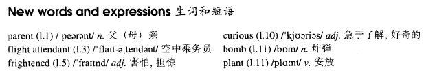

# Lesson 79

## Words

- parent frightened curious bomb plant attendant

- 

## By air

```
I used to travel by air a great deal when I was a boy. My parents used to live in South America and I used to fly there from Europe in the holidays.

A flight attendant would take charge of me and I never had an unpleasant experience. I am used to travelling by air and only on one occasion have I ever felt frightened.

After taking off, we were flying low over the city and slowly gaining height, when the plane suddenly turned round and flew back to the airport.

While we were waiting to land, a flight attendant told us to keep calm and to get off the plane quietly as soon as it had touched down. Everybody on board was worried and we were curious to find out what had happened.

Later we learnt that there was a very important person on board. The police had been told that a bomb had been planted on the plane.

After we had landed, the plane was searched thoroughly. Fortunately, nothing was found and five hours later we were able to take off again.
```

## Questions

1. `I am used to travelling` 为什么 `be used`

2. `have I ever felt frightened`

## Whole

1. `flight attendant` 空中乘务员

2. `feel frightened` 感到害怕

   ```
   It made me feel frightened.
   ```

3. `sb. be curious to find out...` 某人很想知道

   ```
   I'm curious to find out why he have such a bad temper.
   ```

4. `plant bomb` 安放炸弹

   ```
   The police was sure that someone had planted a bomb near the station.
   ```

5. `a great deal` 很多数量。和 `a lot`, `very much` 类似

   ```
   You've done a great deal for your country.
   ```

6. `take charge of...` 负责；承担责任；照顾。

   ```
   His boss asked him to take charge of the office for a few days while she was away.
   ```

7. 和飞机有关的动词词组。 `take off` 起飞。 `gain height` 攀升高度。 `touch down` 降落；着陆

   ```
   The plane is trying to gain height at the moment.

   When the plane touched down, several detectives were waiting at the airport.
   ```

8. `on board` 在飞机上；（船）在甲板上

   ```
   Find out if there's a doctor on board as quietly as you can.
   ```

9. M: `be used to doing sth.` 习惯于做某事

   ```
   He is used to asking his parents to help him.
   ```

10. M: `only` 引导的部分倒装句

    1. 汉语中的倒装句

       ```
       我也没说话啊我寻思着
       // 我寻思着我也没说话啊

       吃了吗你？
       // 你吃了吗？

       这个妹妹很漂亮我觉得
       // 我觉得这个妹妹很漂亮
       ```

    2. `only` 放在句首，主谓（可能）颠倒

       - 可以理解为，变成 `一般疑问句` 时，谁被提到句首，那么谓语就是谁

       ```
       Only on one occasion have I ever felt frightened.
       // `only` 放在句首，主语 `I` 和 谓语 `have` 颠倒

       Only on one occasion I have ever felt frightened.
       // 和上一句等价


       Only then, did I understand what she meant.
       // `only` 放在句首，主语 `I` 和 谓语 `did` 颠倒

       Only then, I understood what she meant.
       // 和上一句等价


       Only after her death was I able to do that.
       // `only` 放在句首，主语 `I` 和 谓语 `was` 颠倒

       Only after her death I was able to do that.
       // 和上一句等价


       Then, and only then, can the door be opened.

       Then, and only then, the door can be opened.


       Only then will the world return to normal.

       Only then the world will return to normal.
       ```

## Exercises

```
Jack was driving the car this morning.

Was he really? He doesn't usually drive it, does he?
```

```
Jack was preparing lunch this morning.

Was he really? He doesn't usually prepare it, does he?
```

```
Jack was exercising the dog this morning.

Was he really? He doesn't usually exercise it, does he?
```

```
Jack was listening to the radio this morning.

Was he really? He doesn't usually listen to it, does he?
```

```
Jack was talking to the postman this morning.

Was he really? He doesn't usually talk to him, does he?
```

```
Jack hardly talked at all today.

I'm not surprised. He was talking all night.
```

```
Jack hardly quarreled at all today.

I'm not surprised. He was quarreling all night.
```

```
Jack hardly cried at all today.

I'm not surprised. He was crying all night.
```

```
Jack hardly slept at all today.

I'm not surprised. He was sleeping all night.
```

```
Jack hardly wrote at all today.

I'm not surprised. He was writing all night.
```

```
Jack has been eating very little recently.

So I noticed. He used to eat a lot.
```

```
Jack has been drinking very little recently.

So I noticed. He used to drink a lot.
```

```
Jack has been talking stupidly recently.

So I noticed. He used to talk sensibly.
```

```
Jack has been working carelessly recently.

So I noticed. He used to work carefully.
```

```
Jack has been going to bed late recently.

So I noticed. He used to go to bed early.
```

```
He used to be a thief, didn't he?

He used to be, but he was working in a bank the last time I saw him.
```

```
He used to be a pilot, didn't he?

He used to be, but he was selling the last time I saw him.
```

```
She used to be an actress, didn't she?

She used to be, but she was looking after her mother the last time I saw her.
```

```
He used to be a teacher, didn't he?

He used to be, but he was playing guitar the last time I saw him.
```

```
She used to be a flight attendant, didn't she?

She used to be, but she was learning to type the last time I saw her.
```
