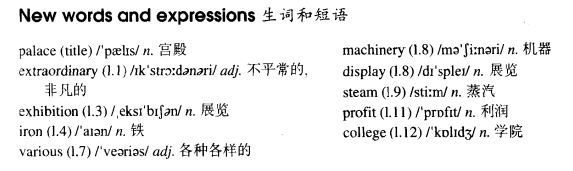

# Lesson 80

## Words

- palace extraordinary exhibition iron various machinery display steam profit college

- 

## The Crystal Palace

```
Perhaps the most extraordinary building of the nineteenth century was the Crystal Palace, which was built in Hyde Park for the Great Exhibition of 1851.

The Crystal Palace was different from all other buildings in the world, for it was made of iron and glass. It was one of the biggest buildings of all time and a lot of people from many countries came to see it.

A great many goods were sent to the exhibition from various parts of the world. There was also a great deal of machinery on display. The most wonderful piece of machinery on show was Nasmyth's steam hammer.

Though in those days, travelling was not as easy as it is today, steam boats carried thousands of visitors across the Channel from Europe.

On arriving in England, they were taken to the Crystal Palace by train. There were six million visitors in all, and the profits from the exhibition were used to build museums and colleges.

Later, the Crystal Palace was moved to South London. It remained one of the most famous buildings in the world until it was burnt down in 1936.
```

## Questions

1. `steam hammer`

## Whole

1. `on display` 展览

   ```
   Machinery like this should be on display right now.
   ```

2. `make a profit` 盈利

   ```
   It takes me ten years to make a profit from this.
   ```

3. `go to college` 上大学

   ```
   Why don't you want to go to college?
   ```

4. `be made of...` 由某物制造

   ```
   It's like that he is made of iron.
   ```

5. `of all time` 有史以来

   ```
   He is still greatest basketball player of all time.
   ```

6. `in all` 总共

   ```
   It's said that there were about 5000 people in all.
   ```

## Exercises

```
These oranges aren't sweet enough.

Get some Spanish oranges. They'd be much sweeter.
```

```
These socks aren't warm enough.

Get some woollen socks. They'd be much warmer.
```

```
These cars aren't big enough.

Get some American cars. They'd be much bigger.
```

```
These watches aren't good enough.

Get some Swiss watches. They'd be much better.
```

```
These bags aren't strong enough.

Get some leather bags. They'd be much stronger.
```

```
Was there much dirt on the floor?

No, it wasn't any dirtier than usual.
```

```
She's the most attractive person I've ever met.

She's not as attractive as you are!
```

```
She's the most interesting person I've ever met.

She's not as interesting as you are!
```

```
She's the most impatient person I've ever met.

She's not as impatient as you are!
```

```
She's the most unfriendly person I've ever met.

She's not as unfriendly as you are!
```

```
She's the most unpleasant person I've ever met.

She's not as unpleasant as you are!
```

```
He drove as quickly as he could.

Yes, he couldn't have driven any more quickly.
```

```
He spoke as loudly as he could.

Yes, he couldn't have spoken any more loudly.
```

```
He wrote as fast as he could.

Yes, he couldn't have written any more fast.
```

```
He stayed as long as he could.

Yes, he couldn't have stayed any longer.
```

```
He sang as clearly as he could.

Yes, he couldn't have sung any more clearly.
```
