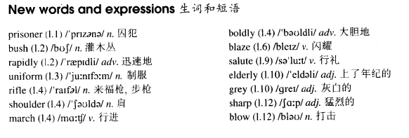

# Lesson 81

## Words

- prisoner bush rapidly uniform rifle shoulder march boldly blaze salute elderly grey sharp blow

- 

## Escape

```
When he had killed the guard, the prisoner of war quickly dragged him into the bushes. Working rapidly in the darkness, he soon changed into the dead man's clothes.

Now, dressed in a blue uniform and with a rifle over his shoulder, the prisoner marched boldly up and down in front of the camp.

He could hear shouting in the camp itself. Lights were blazing and men were running here and there: they had just discovered that a prisoner had escaped.

At that moment, a large black car with four officers inside it, stopped at the camp gates. The officers got out and the prisoner stood to attention and saluted as they passed.

When they had gone, the driver of the car came towards him. The man obviously wanted to talk. He was rather elderly with grey hair and clear blue eyes. The prisoner felt sorry for him, but there was nothing else he could do.

As the man came near, the prisoner knocked him to the ground with a sharp blow. Then, jumping into the car, he drove off as quickly as he could.
```

## Whole

1. `sharp blow` 猛击

   ```
   He was knocked down by a sharp blow on the shoulder.
   ```

2. `change rapidly` 迅速改变

   ```
   Realizing the mission had failed, he changed the plan rapidly.
   ```

3. `up and down` 巡逻，往返；来来回回，在某个地方来回走动。不要理解为 `上下`

   ```
   His wife is having an operation right now, and he is walking up and down inside the waiting room.
   ```

4. `change into` 更换上...衣服

   ```
   I'm curious to find out why you changed into your best clothes.
   ```

5. `sb. discovered that...` 某人发现...

   ```
   I've discovered that you are responsible for this.
   ```

6. `stand to attention` 立正

   ```
   We were ordered to stand to attention.
   ```

7. `knock sb. to the ground` 把某人打倒到地上

   ```
   He hit me so hard that he almost knocked me to the ground.
   ```
