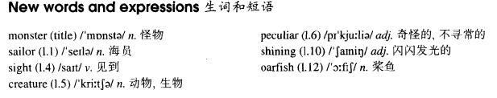

# Lesson 82

## Words

- monster sailor sight creature peculiar shining oarfish eventually tail

- 

## Monster or fish

```
Fishermen and sailors sometimes claim to have seen monsters in the sea. Though people have often laughed at stories told by seamen, it is now known that many of these 'monsters' which have at times been sighted are simply strange fish.

Occasionally, unusual creatures are washed to the shore, but they are rarely caught out at sea.

Some time ago, however, a peculiar fish was caught near Madagascar. A small fishing boat was carried miles out to sea by the powerful fish as it pulled on the line.

Realizing that this was no ordinary fish, the fisherman made every effort not to damage it in any way.

When it was eventually brought to shore, it was found to be over thirteen feet long. It had a head like a horse, big blue eyes, shining silver skin, and a bright red tail.

The fish, which has since been sent to a museum where it is being examined by a scientist, is called an oarfish. Such creatures have rarely been seen alive by man as they live at a depth of six hundred feet.
```

## Questions

1. `Though people have often laughed at stories told by seamen`

## Whole

1. `a shining example` 光辉的榜样

   ```
   I think we should turn our attention to him, for he is a shining example to us.
   ```

2. `claim to have done sth.` 声称已经做了某事

   ```
   She claimed to have set up a new world record.
   ```

3. `laugh at` 嘲笑

   ```
   You're gonna laugh at what I'm gonna say, go ahead, I don't care.
   ```

4. `it is known that...` 这件事已经被人们知道了。 `it is well known that...` 众所周知

   ```
   It is known that he knocked her to the ground with a sharp blow last night.

   It is well known that cats feel frightened when strangers enter the room.
   ```

5. `at times` 有时。类似于 `sometimes`

   ```
   I'm curious to find out why he loses his temper at times.
   ```

6. `out at sea` 在远海，远洋

   ```
   After the fishing boats had been out at sea for three days, they finally came back.
   ```

7. `in any way` 以任何方式

   ```
   I'm not trying to avoid meeting you in any way.
   ```

8. `sb./sth. was found to be...` 某人/某物被发现是什么样子

   ```
   If you are found to be worthless in a company, you will be fired.
   ```

9. `a depth of...` 多深的深度

   ```
   The cave is found to be over a depth of six hundred feet.
   ```

10. `draw up` 起草（协议）

    ```
    Only you can draw up the agreement.
    ```

11. Q: `be supposed to do sth.` 应该去做某事

    ```
    He is supposed to be working.
    他应该去工作
    ```

## Exercises

```
Someone must warn Jack immediately.

Don't worry. He's already been warned.


Someone must examine the body immediately.

Don't worry. It's already been examined.


Someone must polish the floor immediately.

Don't worry. It's already been polished.


Someone must tell the pilot immediately.

Don't worry. He's already been told.


Someone must light the fire immediately.

Don't worry. It's already been lit.
```

```
Have the men been caught yet?

One of them was caught yesterday, but the other hasn't been caught yet.


Have the houses been sold yet?

One of them was sold yesterday, but the other hasn't been sold yet.


Have the books been published yet?

One of them was published yesterday, but the other hasn't been published yet.


Have the trees been cut down yet?

One of them was cut down yesterday, but the other hasn't been cut down yet.


Have the messages been received yet?

One of them was received yesterday, but the other hasn't been received yet.
```

```
Why isn't that man working?

I don't know. He's supposed to be working.


Why aren't the children resting?

I don't know. They're supposed to be resting.


Why isn't he mending the road?

I don't know. He's supposed to be mending the road.


Why aren't they stopping in Rome?

I don't know. They're supposed to stop in Rome.


Why isn't the plane flying to Paris?

I don't know. It's supposed to fly to Paris.
```

```
When will the job be finished?

I've no idea. It should have been finished hours ago.


When will the book be published?

I've no idea. It should have been published months ago.


When will the radio be repaired?

I've no idea. It should have been repaired days ago.


When will the agreement be drawn up?

I've no idea. It should have been drawn up weeks ago.


When will the rubbish be burnt away?

I've no idea. It should have been burnt away days ago.
```
