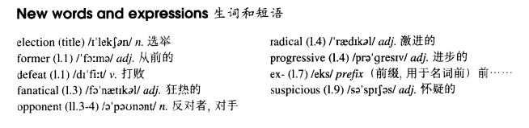

# Lesson 83

## Words

- election former defeat fanatical opponent radical progressive suspicious

- 

## After the elections

```
The former Prime Minister, Mr. Wentworth Lane, was defeated in the recent elections. He is now retiring from political life and has gone abroad.

My friend, Patrick, has always been a fanatical opponent of Mr. Lane's Radical Progressive Party.

After the elections, Patrick went to the former Prime Minister's house. When he asked if Mr. Lane lived there, the policeman on duty told him that since his defeat, the ex-Prime Minister had gone abroad.

On the following day, Patrick went to the house again. The same policeman was just walking slowly past the entrance, when Patrick asked the same question. Though a little suspicious this time, the policeman gave him the same answer.

The day after, Patrick went to the house once more and asked exactly the same question. This time, the policeman lost his temper.

'I told you yesterday and the day before yesterday,' he shouted, 'Mr. Lane was defeated in the elections. He has retired from political life and gone to live abroad!' 'I know,' answered Patrick, 'but I love to hear you say it!'
```

## Whole

1. `win the election` 赢得选举

   ```
   If you won the election, I would give you 2000 dollars.
   ```

2. `former president` 前总统

   ```
   This building takes its name from the former president.
   ```

3. `be fanatical about sth./doing sth.` 对某物很狂热/对做某事很狂热

   ```
   You are fanatical about learning English.
   ```

4. `on duty` 值班，值勤

   ```
   You're not allowed to drink whisky on duty.
   ```

5. `on the following day` 第二天。 类似于 `the next day`

   ```
   On the following day, he helped me to plant the roses in the garden.
   ```

6. `love to do sth.` 热爱做某事

   ```
   They just love to run in the evening.
   ```
