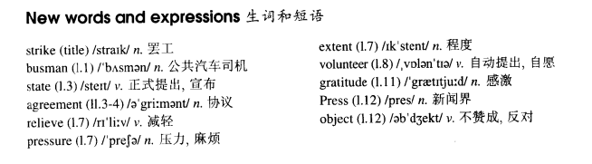

# Lesson 84

## Words

- strike busman state agreement relieve pressure extent volunteer gratitude Press object

- 

## On strike

```
Busmen have decided to go on strike next week. The strike is due to begin on Tuesday. No one knows how long it will last.

The busmen have stated that the strike will continue until general agreement is reached about pay and working conditions. Most people believe that the strike will last for at least a week.

Many owners of private cars are going to offer 'free rides' to people on their way to work. This will relieve pressure on the trains to some extent.

Meanwhile, a number of university students have volunteered to drive buses while the strike lasts. All the students are expert drivers, but before they drive any of the buses, they will have to pass a special test.

The students are going to take the test in two days' time. Even so, people are going to find it difficult to get to work.

But so far, the public has expressed its gratitude to the students in letters to the Press. Only one or two people have objected that the students will drive too fast!
```

## Questions

1. `The strike is due to begin on Tuesday` 中的 `due` 是什么词性

2. `This will relieve pressure on the trains to some extent`

3. `people are going to find it difficult to get to work`

## Whole

1. `go on strike` 罢工

   ```
   The workers refused to go on strike.
   ```

2. `know sth. by heart` 对...烂熟于胸

   ```
   He knew the creature by heart.
   ```

3. `agreement is reached about sth.`, `reach an agreement about sth.` 达成关于某方面的协议

   ```
   They managed to reach an agreement on the environment.
   ```

4. `sb. be relieved to hear that...` 某人因为听到某事而感到宽慰，放松

   ```
   She was relieved to hear that her husband had won the election.
   ```

5. `relieve pressure` 缓解压力

   ```
   This will relieve pressure on you.
   ```

6. `under a lot of pressure` 压力山大

   ```
   He noticed that she'd been under a lot of pressure.
   ```

7. `to some extent` 某种程度上来说

   ```
   To some extent, you feel responsible for his death.

   I agree with you to some extent.
   ```

8. `volunteer to do sth.` 自愿做某事

   ```
   Will anyone volunteer to help me to clean up this mess?
   ```

9. `express A's gratitude to B` 表达 A 的道谢给 B

   ```
   I would like to express my gratitude to everyone that helped us.
   ```

10. `sb. have objected that...` 某人反对...

    ```
    The local busmen have objected to the plans.
    ```

11. `be due to do sth.` 定于某个时间做某事。类似于 `be going to do`，计划打算做某事

    ```
    The former president is due to arrive New York later next month.
    ```

12. `pass/take the test` 通过/参加考试

    ```
    On the following day, he took the test.
    ```

## Exercises

```
How long will they be away?

They'll be away for a month.


How long will they be in hospital?

They'll be hospital for about two weeks.


How long will they be by the sea?

They'll be by the sea for a fortnight.


How long will they be at the meeting?

They'll be at the meeting for two hours.


How long will they be at the seaside?

They'll be at the seaside for quite a while.
```

```
How long will they take to climb the mountain?

They'll climb it in three weeks.


How long will they take to decorate the house?

They'll decorate it in three days.


How long will they take to sail the Atlantic?

They'll sail it in about a month.


How long will they take to reply to the letter?

They'll reply to it in a week.


How long will they take to mend the radio?

They'll mend it about two days.
```

```
We're going to see the film. Do you want to come?

No thanks. I'll go and see it later.


We're going to read the notice. Do you want to come?

No thanks. I'll go and read it later.


We're going to admire the view. Do you want to come?

No thanks. I'll go and admire it later.


We're going to speak to the manager. Do you want to come?

No thanks. I'll go and speak to him later.


We're going to look at the picture. Do you want to come?

No thanks. I'll go and look at it later.
```

```
He's going into hospital some time.

Is he? Let me know when he goes.


He's going to set out for the North Pole some time.

Is he? Let me know when he sets out.


He's going to come back from Europe some time.

Is he? Let me know when he comes back.


He's going to return from his holiday some time.

Is he? Let me know when he returns.


He's going to arrive at the airport some time.

Is he? Let me know when he arrives.
```
