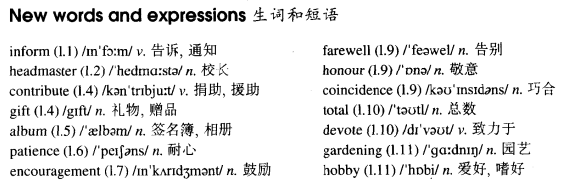

# Lesson 85

## Words

- inform headmaster contribute gift album patience encouragement farewell honour coincidence total devote gardening hobby

- 

## Never too old to learn

```
I have just received a letter from my old school, informing me that my former headmaster, Mr. Stuart Page, will be retiring next week.

Pupils of the school, old and new, will be sending him a present to mark the occasion.

All those who have contributed towards the gift will sign their names in a large album which will be sent to the headmaster's home.

We shall all remember Mr. Page for his patience and understanding and for the kindly encouragement he gave us when we went so unwillingly to school.

A great many former pupils will be attending a farewell dinner in his honour next Thursday.

It is a curious coincidence that the day before his retirement, Mr. Page will have been teaching for a total of forty years.

After he has retired, he will devote himself to gardening. For him, this will be an entirely new hobby.

But this does not matter, for, as he has often remarked, one is never too old to learn.
```

## Whole

1. 文中 `for, as he has often remarked` 的 `as` 为 `正如`

2. `A inform B that...` A 通知 B 某事

   ```
   The teacher informed the kid's parents that he lost his temper in the class.
   ```

3. `make a contribution`, `contribute to...` 贡献

   ```
   It is no use pretending that you haven't contributed to the business.
   ```

4. `lose sb's patience` 失去耐心

   ```
   He kept on crying and I lost my patience.
   ```

5. `have a lot of patience` 很有耐心

6. `in sb's honor` 对某人有敬意

   ```
   We'd like to invite you to join us for a party in your honour!
   我们想邀请您参加我们的派对作为对您的敬意！
   ```

7. `it is a curious coincidence that...` 这是一个很奇妙的巧合...

   ```
   It's no coincidence that people went on strike on the same day that he won the election.
   ```

8. `a total of...` 总共

   ```
   They received a total of 20 letters from fans last week.
   ```

9. `sb. devote oneself to sth./doing sth.` 某人把自己致力于某事/做某事上

   ```
   After I had graduated, I continued to devote myself to research.
   ```

10. `mark the occasion` 纪念这一刻

    ```
    I'd like to say a few words to mark the occasion.
    ```

11. `turn sb. down` 拒绝某人

    ```
    We should do something to mark the occasion, but you've already turned me down.
    ```

12. `remember sb. for sth.` 因为某事而记住某人

    ```
    They stated that they would remember him for his courage.
    ```

## Exercises

```
How much longer will he be staying at the library?

He'll have to stay here until he's read those papers.


How much longer will he be staying at the hotel?

He'll have to stay here until he has rented a flat.


How much longer will he be staying at school?

He'll have to stay here until he has corrected the tests.


How much longer will he be staying at home?

He'll have to stay here until he has started a new job.
```

```
Will you be having invitations printed for the wedding?

Yes, we will. I only hope they'll be printed in time.


Will you be having your passport renewed for the trip?

Yes, we will. I only hope they'll be renewed in time.


Will you be having decorations put up for dance?

Yes, we will. I only hope they'll be put up in time.


Will you be having programmes printed for play?

Yes, we will. I only hope they'll be printed in time.
```

```
We can't visit the Smiths now. They'll be having lunch.

They'll have had lunch by now, surely?


We can't visit the Smiths now. They'll be feeding the horses.

They'll have fed them by now, surely?


We can't visit the Smiths now. They'll be putting the children to bed.

They'll have put them to bed by now, surely?


We can't visit the Smiths now. They'll be washing up.

They'll have washed up by now, surely?


We can't visit the Smiths now. They'll be packing their bags.

They'll have packed them by now, surely?
```

```
Shall we visit the Smiths tonight, or will they still be working?

If they are, they'll have been working the whole day!


Shall we visit the Smiths tonight, or will they still be practicing?

If they are, they'll have been practicing the whole day!


Shall we visit the Smiths tonight, or will they still be decorating?

If they are, they'll have been decorating the whole day!


Shall we visit the Smiths tonight, or will they still be resting?

If they are, they'll have been resting the whole day!


Shall we visit the Smiths tonight, or will they still be painting?

If they are, they'll have been painting the whole day!
```
