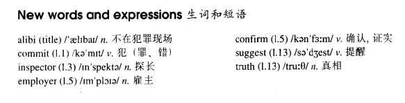

# Lesson 87

## Words

- alibi commit inspector employer confirm suggest truth

- 

## A perfect alibi

```
'At the time the murder was committed, I was travelling on the 8 o'clock train to London,' said the man.

'Do you always catch such a early train?' asked the inspector.

'Of course I do,' answer the man. 'I must be at work at 10 o'clock. My employer will confirm that I was there on time.'

'Would a later train get you to work on time?' asked the inspector. 'I suppose it would, but I never catch a later train.'

'At what time did you arrive at the station?'

'At ten to eight. I bought a paper and waited for the train.'

'And you didn't notice anything unusual?'

'Of course not.'

'I suggest,' said the inspector, 'that you are not telling the truth.'

'I suggest that you did not catch the 8 o'clock train, but that you caught the 8.25 which would still get you to work on time.'

'You see, on the morning of the murder, the 8 o'clock train did not run at all. It broke down at Ferngreen station and was taken off the line.'
```

## Whole

1. `sb. suggest...` 某事暗示...

   ```
   Are you suggesting I'm lazy?
   ```

2. 文中的 `taken off the line` 结合语境可以理解为 `把这趟车从发车时刻表上去掉，下线`

3. `on time` 准时

   ```
   I want you to get to school on time tomorrow morning.
   ```
