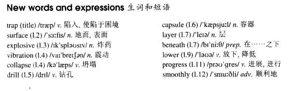

# Lesson 88

## Words

- trap surface explosive vibration collapse drill capsule layer beneath lower progress smoothly

- 

## Trapped in a mine

```
Six man have been trapped in a mine for seventeen hours. If they are not brought to the surface soon they may lose their lives.

However, rescue operations are proving difficult. If explosives are used, vibrations will cause the roof of the mine to collapse.

Rescue workers are therefore drilling a hole on the north side of the mine. They intend to bring the men up in a special capsule.

If there had not been a hard layer of rock beneath the soil, they would have completed the job in a few hours. As it is, they have been drilling for sixteen hours and they still have a long way to go.

Meanwhile, a microphone, which was lowered into the mine two hours ago, has enabled the men to keep in touch with their closest relatives. Though they are running out of food and drink, the men are cheerful and confident that they will get out soon.

They have been told that rescue operations are progressing smoothly. If they knew how difficult it was to drill through the hard rock, they would lose heart.
```

## Questions

1. `Though they are running out of food and drink`

## Whole

1. `on the surface` 表面上，主观上常说的 `表面功夫`

   ```
   On the surface, she kept on helping him.
   // 表面上帮，不是真心想帮
   ```

2. `a layer of sth.` 一层...

   ```
   Glass must be packed in several layers of paper.
   ```

3. `lower back` （身体的）下背，下腰

   ```
   It was obvious that he had hurt his lower back.
   ```

4. `make progress` 有进展

   ```
   We're not finished yet, but we're making progress.
   ```

5. `go/run smoothly` 进展顺利

   ```
   I'm sure that everything will go smoothly in the next few weeks.
   ```

6. `run out of sth.` 用完某物

   ```
   If I ran out of petrol, I'd walk to the nearest garage.

   I have been doing this for ten hours and I've run out of patience.
   ```

7. `lose one's life` 失去生命

   ```
   He failed to get out the building, and lost his life there.
   ```

8. `as it is...` 事实上

   ```
   We were hoping to have a holiday next week as it is, we may not be able to get away.
   我们希望下周能去度个假，但事实上我们可能走不了
   ```

9. `enable sb. to do sth.` 确保某人去做某事

   ```
   This dictionary will enable you to understand English words.
   ```

10. `keep in touch with sb.` 和某人保持联系

    ```
    We decided to keep in touch with each other.
    ```

11. `lose heart` 失去信心

    ```
    Although we have run out of food, we will not lose heart.
    ```

12. `cause sb./sth. to do sth.` 引起某人/某物怎么怎么样

    ```
    You've caused me to lose a whole valuable day's work.

    What caused you to change your mind?
    ```
