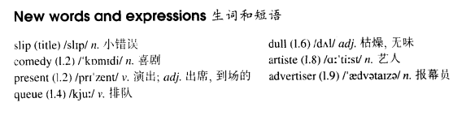

# Lesson 89

## Words

- slip comedy present queue dull artiste advertiser awkwardly bump

- 

## A slip of the tongue

```
People will do anything to see a free show - even if it is a bad one.

When the news got round that a comedy show would be presented at our local cinema by the P. and U. Bird Seed Company, we all rushed to see it.

We had to queue for hours to get in and there must have been several hundred people present just before the show began.

Unfortunately, the show was one of the dullest we have ever seen.

Those who failed to get in need not have felt disappointed, as many of the artistes who should have appeared did not come.

The only funny things we heard that evening came from the advertiser at the beginning of the programme.

He was obviously very nervous and for some minutes stood awkwardly before the microphone. As soon as he opened his mouth, everyone burst out laughing.

We all know what the poor man should have said, but what he actually said was: 'This is the Poo and Ee Seed Bird Company. Good ladies, evening and gentlemen!'
```

## Questions

1. `When the news got round that a comedy show would be presented` 的 `got round`

2. `but what he actually said was`

## Whole

1. `a slip of the tongue` 口误

   ```
   Did I call you Jason? Sorry, Jack, just a slip of the tongue.
   ```

2. `do anything to do sth.` 尽全力做某事

   ```
   He'll do anything to win the election.
   ```

3. `the news get round` 消息四散传开

   ```
   The story has got round, and everyone knows about it.
   ```

4. `feel disappointed` 感到失望

   ```
   When things went wrong, everyone felt disappointed.
   ```

5. `at the beginning of A` 在 A 开始的时候

   ```
   We ran out of money at the beginning of April.
   ```

6. `burst out laughing` 大笑

   ```
   In the end, I couldn't control myself and burst out laughing.
   ```

## Exercises

```
She needn't have washed the dishes.

She had to wash them or her husband would have been furious with her.


She needn't have tidied the room.

She had to tidy it or her husband would have been furious with her.


She needn't have fed the dog.

She had to feed it or her husband would have been furious with her.


She needn't have paid the bill.

She had to pay it or her husband would have been furious with her.


She needn't have gone shopping.

She had to go shopping or her husband would have been furious with her.
```

```
Didn't Mary type the letters yesterday?

They'd already been typed, so she didn't have to type them.


Didn't Jack prepare the speech yesterday?

It had already been prepared, so he didn't have to prepare it.


Didn't Jack make the decision yesterday?

It'd already been made, so he didn't have to make it.


Didn't Jack sign the contract yesterday?

It'd already been signed, so he didn't have to sign it.


Didn't Jack mend the light yesterday?

It'd already been mended, so he didn't have to mend it.
```

```
You mustn't read so much or you'll strain your eyes.

I've got to do a lot of reading. It's part of my job.


You mustn't shout so much or you'll strain your voice.

I've got to do a lot of shouting. It's part of my job.


You mustn't run about so much or you'll strain your heart.

I've got to do a lot of running about. It's part of my job.


You mustn't bend over so much or you'll strain your back.

I've got to do a lot of bending over. It's part of my job.
```

```
I can't understand it. He ought to have arrived by now.

He must have been delayed.


I can't understand it. He ought to have been here by now.

He must have been kept at the office.


I can't understand it. He ought to have come back by now.

He must have been caught by the police.


I can't understand it. He ought to have set out by now.

He must have been taken ill.


I can't understand it. He ought to have done the job by now.

He must have been arrested.
```
