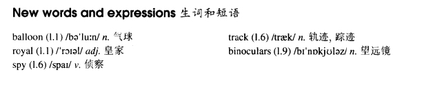

# Lesson 91

## Words

- balloon royal spy track binoculars

- 

## Three men in a basket

```
A pilot noticed a balloon which seemed to be making for a Royal Air Force Station nearby. He informed the station at once, but no one there was able to explain the mystery.

The officer in the control tower was very angry when he heard the news, because balloons can be a great danger to aircraft.

He said that someone might be spying on the station and the pilot was ordered to keep track of the strange object.

The pilot managed to circle the balloon for some time. He could make out three men in a basket under it and one of them was holding a pair of binoculars.

When the balloon was over the station, the pilot saw one of the men taking photographs. Soon afterwards, the balloon began to descend and it landed near an airfield.

The pilot were called in, but they could not arrest anyone, for the basket contained two Members of Parliament and the Commanding Officer of the station!

As the Commanding Officer explained later, one half of the station did not know what the other half was doing!
```

## Questions

1. Q: 翻译以下对话

   ```
   She didn't swim across the river.

   No, but she could have if she'd wanted to.
   // 这句话怎么翻译？怎么断句？
   // she could have done if she had wanted to.
   ```

## Whole

1. `spy on sb./sth.` 监视某人/某物

   ```
   He has spied on that man for weeks.
   ```

2. `keep track of...` 追踪；记录

   ```
   How do you keep track of time if you don't wear a watch?
   ```

3. `top secret` 最高机密

   ```
   The things that he saw through his binoculars were top secrets.
   ```

4. `seem to be doing` 似乎是正在做某事

   ```
   You seem to be taking a risk.
   ```

5. `make for sw.` 走过去到某个地方

   ```
   It's getting late, we'd better go and make for home.
   ```

6. `make out` 看出，辨别出

   ```
   I can read most of this, but I can't make out the last part, can you?
   ```

7. `soon afterwards` 很快

   ```
   Soon afterwards, they removed the gate from the front yard.
   ```

8. `be called in` 被人紧急地要求去处理某事

   ```
   All detectives were called in to help.
   ```

## Exercises

```
Where shall I put these towels?

You can put them in the cupboard.


Where shall I hang the wet clothes?

You can hang them in the sun.


Where shall I write the report?

You can write it in the library.


Where shall I park the car?

You can park it in that car park.


Where shall I buy the medicine?

You can buy it from the chemist's.
```

```
Can you go and see Mary soon?

I may be able to go and see her tomorrow.


Can you mend this strap soon?

I may be able to mend it tomorrow.


Can you take me to zoo soon?

I may be able to take you to zoo tomorrow.


Can you have lunch with us soon?

I may be able to have lunch with you tomorrow.


Can you come to see us soon?

I may be able to come to see you tomorrow.
```

```
Why didn't you jump over the stream?

I couldn't jump over it. It was too wide.


Why didn't you carry the case?

I couldn't carry it. It was too heavy.


Why didn't you buy the flat?

I couldn't buy it. It was too expensive.


Why didn't you move the cupboard?

I couldn't move it. It was too big.


Why didn't you drink your soup?

I couldn't drink it. It was too hot.
```

```
The door was locked, wasn't it?

Yes, but I managed to open it in the end.


He refused to agree, didn't he?

Yes, but I managed to persuade him in the end.


The horse ran away, didn't it?

Yes, but I managed to catch it in the end.


The box was very heavy, wasn't it?

Yes, but I managed to lift it in the end.


The river was very wide, wasn't it?

Yes, but I managed to get across it in the end.
```
