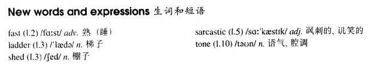

# Lesson 92

## Words

- fast ladder shed sarcastic tone

- 

## Asking for trouble

```
It must have been about two in the morning when I returned home. I tried to wake up my wife by ringing the doorbell, but she was fast asleep, so I got a ladder from the shed in the garden, put it against the wall, and began climbing towards the bedroom window.

I was almost there when a sarcastic voice below said, 'I don't think the windows need cleaning at this time of the night.' I looked down and nearly fell off the ladder when I saw a policeman.

I immediately regretted answering in the way I did, but I said, 'I enjoy cleaning windows at night.'

'So do I,' answered the policeman in the same tone. 'Excuse my interrupting you.' I hate to interrupt a man when he's busy working, but would you mind coming with me to the station?'

'Well, I'd prefer to stay here,' I said. 'You see, I've forgotten my key.'

'Your what?' he called.

'My key,' I shouted.

Fortunately, the shouting woke up my wife, who opened the window just as the policeman had started to climb towards me.
```

## Whole

1. `fast asleep` 睡得很熟

   ```
   When he went upstairs five minutes later, she was fast asleep.
   ```

2. `are you being sarcastic?` 你在讽刺我吗？

3. `don't take that tone with me!` 别用那种语气跟我说话！

4. `just as` 正当...的时候

5. `hate to do sth.` 讨厌做某事

   ```
   I hate to see them laughing at you.
   ```
