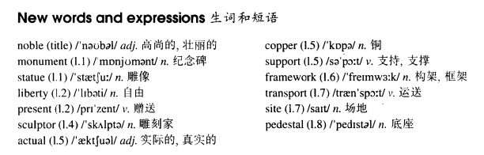

# Lesson 93

## Words

- noble monument statue liberty present sculptor actual copper support framework site pedestal transport harbour

- 

## A noble gift

```
One of the most famous monuments in the world, the Statue of Liberty, was presented to the United States of America in the nineteenth century by the people of France.

The great statue, which was designed by the sculptor Auguste Bartholdi, took ten years to complete. The actual figure was made of copper supported by a metal framework which had been especially constructed by Eiffel.

Before it could be transported to the United States, a site had to be found for it and a pedestal had to be built. The site chosen was an island at the entrance of New York Harbour.

By 1884, a statue which was 151 feet tall had been erected in Paris. The following year, it was taken to pieces and sent to America.

By the end of October 1886, the statue had been put together again and it was officially presented to the American people by Bartholdi.

Ever since then, the great monument has been a symbol of liberty for the millions of people who have passed through New York Harbour to make their homes in America.
```

## Whole

1. 文中的 `the site chosen was an island at the entrance of New York Harbour` 的 `chosen` 实际上是过去分词做定语。 翻译为 `被选中的地点`

2. `a noble man` 一个高尚的人

   ```
   Don't take that tone with him, for he is a noble man.
   ```

3. `camp site` 露营地

   ```
   There are all sorts of activities for kids at the camp site.
   ```

4. `at the entrance of...` 在...的入口处

   ```
   I'll waiting for you at the entrance of the station.
   ```

5. `take sth. to pieces` 把某物拆成一个个组件

   ```
   They took the bed to pieces and moved it out of the room.
   ```

## Exercises

```
Where will they be sending my case?

It'll be sent to your home.


Where will they be testing the oil rig?

It'll be tested in the North Sea.


Where will they be giving the lecture?

It'll be given in the town hall.


Where will they be constructing the stadium?

It'll be constructed at Wembley.


Where will they be making the film?

It'll be made at the studio.
```

```
I can't get this camera to work, it must be broken.

Then it'll have to be repaired.


I can't get these scissors to work, they must be broken.

Then they'll have to be repaired.


I can't get these microphones to work, it must be broken.

Then they'll have to be repaired.


I can't get this machine to work, it must be broken.

Then it'll have to be repaired.


I can't get this loudspeaker to work, it must be broken.

Then it'll have to be repaired.
```

```
Why can't the luggage be sent now?

It must be weighed before it can be sent.


Why can't the workers be admitted now?

They must be researched before they can be admitted.


Why can't the vegetables be cooked now?

They must be cut up before they can be cooked.


Why can't the house be occupied now?

It must be cleaned before it can be occupied.


Why can't the notice be put up now?

It must be corrected before it can be put up.
```

```
What happened to the luggage?

It had to be weighed before it could be sent.


What happened to the workers?

They had to be researched before they could be admitted.


What happened to the vegetables?

They had to be cut up before they could be cooked.


What happened to the house?

It had to be cleaned before it could be occupied.


What happened to the posters?

They had to be corrected before they could be put up.
```
