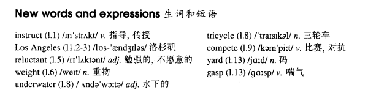

# Lesson 94

## Words

- instruct Los Angeles reluctant weight underwater tricycle compete yard gasp

- 

## Future champions

```
Experiments have proved that children can be instructed in swimming at a very early age.

At a special swimming pool in Los Angeles, children become expert at holding their breath under water even before they can walk.

Babies of two months old do not appear to be reluctant to enter the water. It is not long before they are so accustomed to swimming that they can pick up weights from the floor of the pool.

A game that is very popular with these young swimmers is the underwater tricycle race. Tricycles are lined up on the floor of the pool seven feet under water. The children compete against each other to reach the other end of the pool.

Many pedal their tricycles, but most of them prefer to push or drag them. Some children can cover the whole length of the pool without coming up for breath even once.

Whether they will ever become future Olympic champions, only time will tell. Meanwhile, they should encourage those among us who cannot swim five yards before they are gasping for air.
```

## Questions

1. `coming up for breath even once` 的 `coming up`？ 为了哪怕一次呼吸

2. `they should encourage those among us who cannot swim five yards before they are gasping for air`

## Whole

1. `Los Angeles` 洛杉矶

2. 文中 `many pedal their tricycles` 的 `many` 指代 `许多孩子`，`many children` 的缩写

3. 文中 `they should encourage those among us who cannot swim five yards before they are gasping for air` 的 `among us` 和 `who cannot swim five yards before they are gasping for air` 修饰的都是 `those`

4. `instruct sb. in sth./doing sth.` = `be instructed in doing sth.` 教某人去做某事

   ```
   My job is to instruct her in English.

   He instructed me in building a boat.
   ```

5. `be reluctant to do sth.` 很不情愿地去做某事

   ```
   She was very reluctant to tell the truth.
   ```

6. `compete against` 竞争

   ```
   I had to compete against 19 other people for the job.
   ```

7. `sb./sth. proved that...` 某人/某物证明...

   ```
   He proved that he was right and we were moving in a circle.
   ```

8. `hold sb's breath` 屏住某人的呼吸

   ```
   How long can you hold your breath?
   ```

9. `be accustomed to doing sth.` 习惯于做某事

   ```
   I am accustomed to changing into uniform before work.
   ```

10. `be popular with...` 在...当中很流行

    ```
    This dance is popular with young people.
    ```

11. `be lined up` 被排成一排

    ```
    They were lined up in front of the store.
    ```
