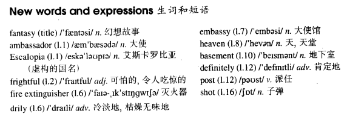

# Lesson 95

## Words

- fantasy ambassador Escalopia frightful drily embassy heaven basement definitely post shot extinguisher

- 

## A fantasy

```
When the Ambassador of Escalopia returned home for lunch, his wife got a shock. He looked pale and his clothes were in a frightful state.

'What has happened?' she asked. 'How did your clothes get into such a mess?'

'A fire extinguisher, my dear,' answered the Ambassador drily. 'University students set the Embassy on fire this morning.'

'Good heavens!' exclaimed his wife. 'And where were you at the time?'

'I was in my office as usual,' answered the Ambassador. 'The fire broke out in the basement. I went down immediately, of course, and that fool, Horst, aimed a fire extinguisher at me. He thought I was on fire. I must definitely get that fellow posted.'

The Ambassador's wife went on asking questions, when she suddenly noticed a big hole in her husband's hat.

'And how can you explain that?' she asked.

'Oh, that,' said the Ambassador. 'Someone fired a shot through my office window. Accurate, don't you think? Fortunately, I wasn't wearing it at the time. If I had been, I would not have been able to get home for lunch.'
```

## Questions

1. `I must definitely get that fellow posted`

2. `Accurate, don't you think?`

## Whole

1. `fire extinguisher` 灭火器

2. `live in a fantasy world` 活在幻想中

   ```
   If you didn't knock on my door that day I'd still be living in a fantasy world.
   ```

3. `good heavens!` 天呐！

   ```
   Good heavens! How can you hold your breath for ten minutes?
   ```

4. `fire a shot` 开枪

   ```
   It comes as a surprise to learn that he didn't fire a shot.
   ```

5. `get into such a mess` 变得一团糟

   ```
   If you're going to the park, please don't get into a mess!
   如果你去公园，不要玩得太嗨，给自己弄得满身都是泥巴！
   // 根据语境翻译
   ```

6. `set sth. on fire` 将某物点着

   ```
   Don't smock in the room. You're gonna set this room on fire.
   ```

7. `go on doing sth.` 持续做某事

   ```
   We must go on giving him encouragement.
   ```
