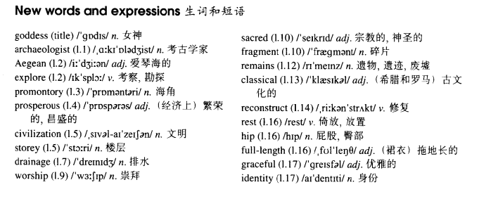

# Lesson 3

## Words

- goddess archaeologist Aegean explore promontory prosperous civilization storey drainage worship sacred fragment remains classical reconstruct rest hip graceful identity

- 

## Whole

1. `full length` （裙衣）拖地长的
