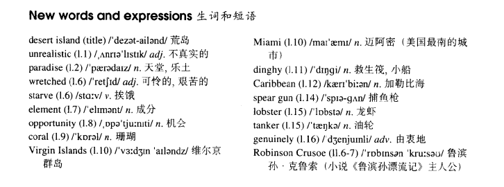

# Lesson 12

## Words

- desert unrealistic paradise wretched starve element opportunity coral Virgin Miami dinghy Caribbean spear lobster tanker genuinely

- 

## Whole

1. `desert island` 荒岛

2. `Virgin Islands` 维尔京群岛

3. `spear gun` 捕渔枪
