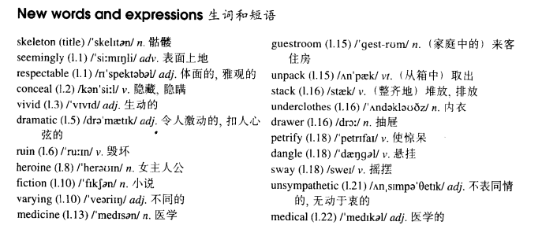

# Lesson 24

## Words

- skeleton seemingly respectable conceal vivid dramatic ruin heroine fiction varying medicine guestroom unpack stack underclothes drawer petrify dangle sway unsympathetic medical

- 
