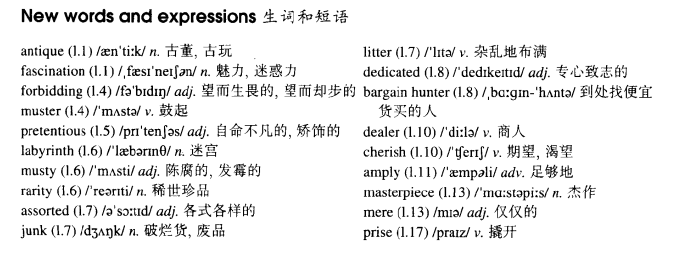

# Lesson 34

## Words

- antique fascination forbidding muster pretentious labyrinth musty rarity assorted junk litter dedicated bargain hunter dealer cherish amply masterpiece mere prise

- 

## Whole

1. `bargain hunter` 到处找便宜货买的人
