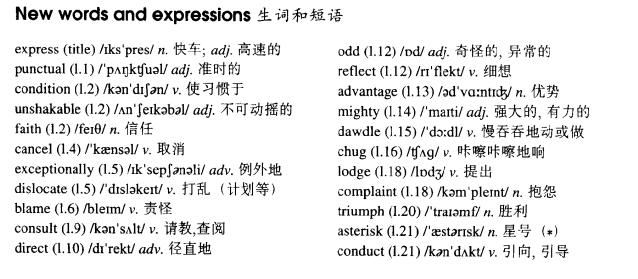

# Lesson 37

## Words

- express punctual condition unshakable faith cancel exceptionally dislocate blame consult direct odd reflect advantage mighty dawdle chug lodge complaint triumph asterisk conduct

- 
