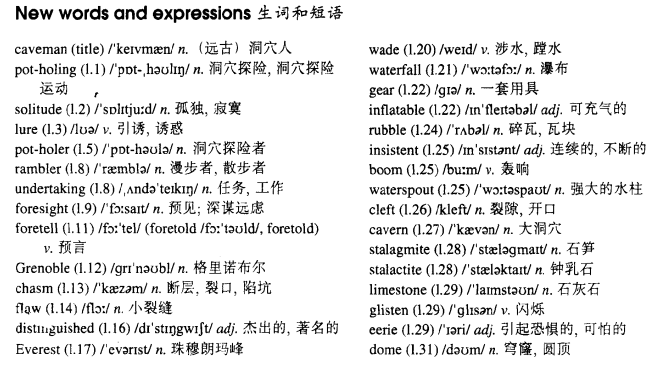

# Lesson 42

## Words

- caveman solitude lure rambler undertaking foresight foretell foretold chasm flaw distinguished Everest wade waterfall gear inflatable rubble insistent boom waterspout cleft cavern stalagmite stalactite limestone glisten eerie dome

- 

## Whole

1. `pot holing` 洞穴探险运动

2. `pot holer` 洞穴探险者
