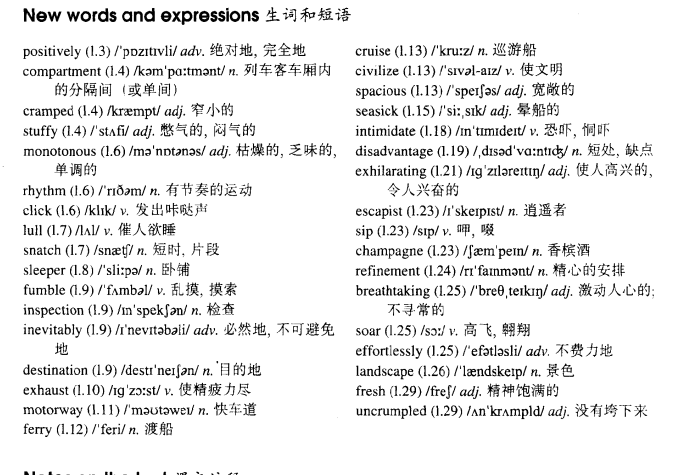

# Lesson 44

## Words

- positively compartment cramped stuffy monotonous rhythm click lull snatch sleeper fumble inspection inevitably destination exhaust motorway ferry cruise civilize spacious seasick intimidate disadvantage exhilarating escapist sip champagne refinement breathtaking soar effortlessly landscape fresh uncrumpled

- 
