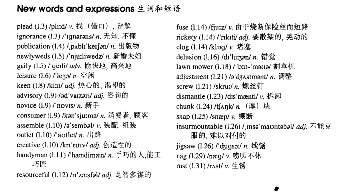

# Lesson 46

## Words

- plead ignorance publication newlyweds gaily leisure keen advisory novice consumer assemble outlet creative handyman resourceful fuse rickety clog delusion mower adjustment screw dismantle chunk snap insurmountable jigsaw nag rust

- 

## Whole

1. `lawn mower` 割草机
