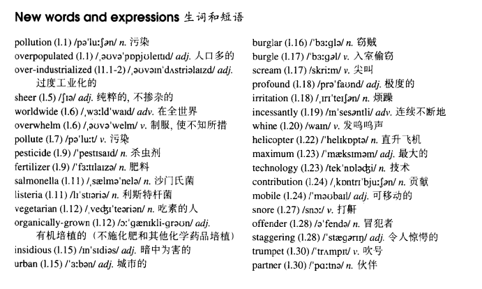

# Lesson 47

## Words

- pollution overpopulated industrialized sheer worldwide overwhelm pollute pesticide fertilizer salmonella listeria vegetarian organically insidious urban burglar burgle scream profound irritation incessantly whine helicopter maximum technology mobile snore offender staggering trumpet partner

- 

## Whole

1. `over industrialized` 过度工业化的

2. `organically grown` 有机培育的
