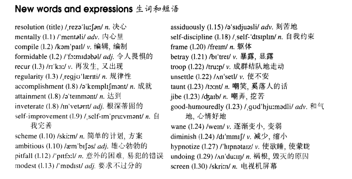

# Lesson 50

## Words

- resolution mentally compile formidable recur regularity accomplishment attainment inveterate scheme ambitious modest assiduously frame betray troop unsettle taunt jibe humouredly wane diminish hypnotize undoing screen

- 

## Whole

1. `self improvement` 自我完善

2. `self discipline` 自我约束

3. `good humourously` 和气地
