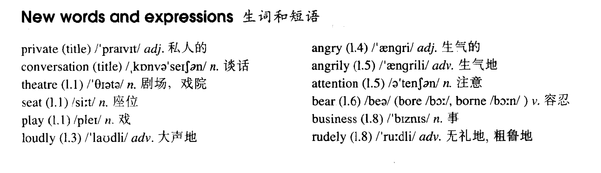

# Lesson 1

## Words

- private conversation theatre seat loudly angry angrily attention bear business rudely bore borne

- 

## A private conversation

```
Last week I went to the theatre. I had a very good seat. The play was very interesting. I did not enjoy it

A young man and a young woman were sitting behind me. They were talking loudly

I got very angry. I could not hear the actors. I turned round. I looked at the man and the woman angrily. They did not pay any attention

In the end, I could not bear it. I turned round again. 'I can't hear a word!' I said angrily

'It's none of your business,' the young man said rudely. 'This is a private conversation!'
```

## Whole

1. 单词造句指南

   - v. + v.变化
   - 四句型转换
   - 方式/地点/时间
   - 结合习惯用法
   - 其它单词+词性
   - 原文摘抄+变

2. 造一个好句子

   - +adj.
   - +adv.
   - +时间
   - +地点

   ```
   The man is waiting for a bus

   The tall man is waiting for a bus

   The tall man is waiting for a bus angrily

   The tall man was waiting for a bus angrily at last night

   The tall man was waiting for a bus angrily at the bus stop at last night
   ```

3. 一个句子的组成方式

   | 1. 主语           | 2. 谓语     | 3. 宾语           | 4. 方式 | 5. 地点         | 6. 时间       |
   | ----------------- | ----------- | ----------------- | ------- | --------------- | ------------- |
   | Who? Which? What? | action      | Who? Which? What? | How?    | Where?          | When          |
   | The tall man      | was waiting | for a bus         | angrily | at the bus stop | at last night |

4. `take a seat` 请坐

5. `Is this seat taken?` 这座位有人坐吗？

6. `pay attention` 请注意

7. `It's none of your business` 不关你的事
