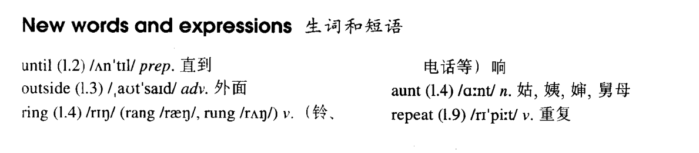

# Lesson 2

## Words

- until outside ring aunt repeat

- 

## Whole

1. 现在进行时也可以表示即将发生的动作，一般指按计划或者安排好要发生的动作

   ```
   I'm meeting my friends
   我正在见我的朋友
   // 正在发生的事

   We're having a party
   // 正在发生的事
   ```

   ```
   I'm meeting my friends tonight
   今晚我要见我的朋友
   // 今晚要做的事。按照计划我要见我的朋友

   We're having a party next week
   下周我们有一个派对
   // 下周的计划。安排好了下周要发生“开派对”这个动作
   ```

2. 现在进行时表示现阶段正在进行的动作，但说话的时候不一定正在进行

   ```
   Jack is driving very fast these days, he doesn't usually drive very fast
   这些天他开车开得很快，通常他不开这么快的
   // `these days`表示现阶段，一段时间。但是说这句话时，Jack不一定正在开得很快

   She's writing a novel
   // 这段时间里她正在写小说，但是说这句话的她不一定正在写，可能在休息一会
   ```

3. 感叹句

   - 结构：`What + （形容词） + n + （主语 + 谓语）`

   ```
   This is a beautiful picture

   What a beautiful picture this is!
   // 完整的感叹句

   What a beautiful picture!
   // 通常会把主语和谓语省略掉

   It's a terrible day

   What a terrible day it is!

   What a terrible day!

   They are wonderful actors

   What wonderful actors they are!

   What wonderful actors!
   // 复数情况下不要加`a/an`
   ```

4. 频率 adv.

   - 例如： always & sometimes & usually & seldom

   - 规则：
     1. v. 前面
     2. be 后面
     3. 很多例外情况

   ```
   I never get up early on Sundays
   // v. 前面
   ```
