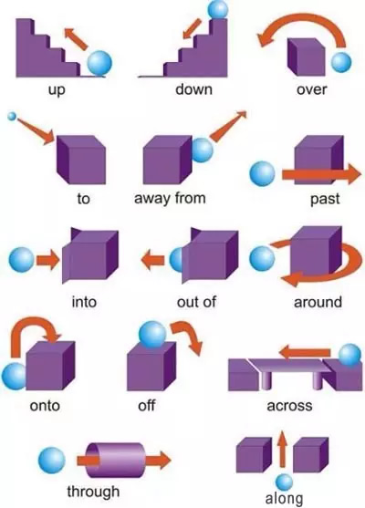
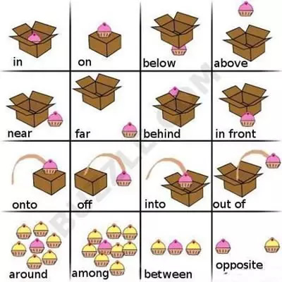
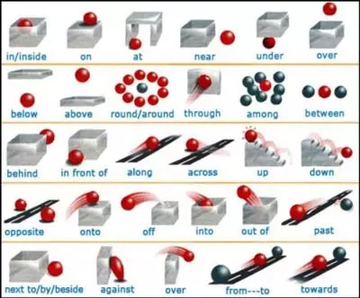
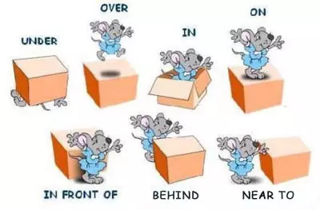
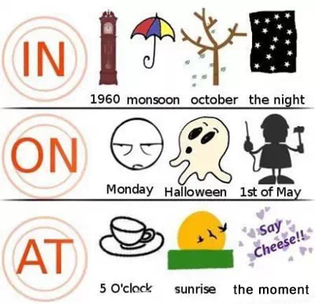
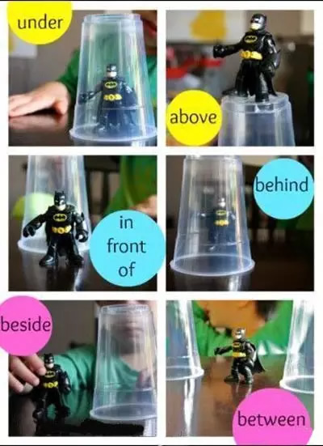
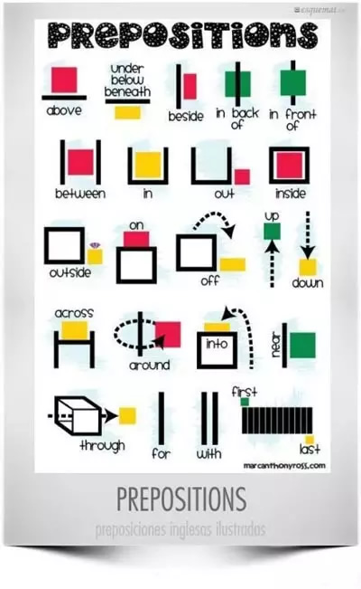

# 介词

## in

- **表示地点、场所或范围**

  ```
  He lived in a small village
  他过去住在一个小村庄里
  //这里in就表示在...里，一个村庄是一个地点，他住在这个地点里

  There are many stars in the sky
  天空中有好多星星
  //天空是一个大的范围，而这些星星就在这个范围里

  He is tallest boy in the class
  他是这个班里最高的男孩
  //class是一个场所，他是和这个班里的同学做比较，所以他也在这个班里
  ```

- **表示一段时间里**

  ```
  We'll play football in the afternoon
  我们下午将踢足球
  //下午是一段时间，它是相对于一天来说的，所以是一个大的时间范围，我们是在这个大的时间范围里踢球，用in

  She was born in 1998
  她出生于1998年
  //一年也是一个大的时间范围，她是在1998这一年里出生，用in
  ```

- **表示一段时间之后**

  ```
  My father will come back in a week
  我爸爸将在一周后回来
  //一周是一段时间
  ```

- **表示状态、情况或境遇**

  ```
  The old man is in good health
  这位老人身体很好
  //good health是一种状态，老人处于这种状态里

  His grandmother's life is in danger
  他祖母的生命有危险
  //danger是一种情况，他祖母处于这种情况中

  The woman is in trouble
  这位妇女处于险境中
  //trouble是一种境遇，妇女处于这种境遇中
  ```

- **参考链接**<https://www.xuexila.com/yingyu/danci/190471.html>

## on

- **表示在...的上面或表面**

  ```
  The apples are on the table
  苹果在桌子上
  //苹果位于桌子的上面，说明苹果跟桌子的表面有相交，用on

  Apples grow on trees
  苹果长在树上
  //苹果是挂在树的上面的，用on

  The picture is hung on the wall
  这张照片挂在墙上
  //照片是跟墙的表面有相交的，用on

  ```

- **表示方位，这个方位是两个地方相连接或者毗邻的**

  ```
  The cake is on the left
  蛋糕在左边
  //在左边，那么肯定有右边，而左右两边必定形成一个整体。而这个蛋糕是在这个整体的某一个方位，用on

  Tom sits on my right
  汤姆坐在我右边
  //把我的左右两边看作一个整体，汤姆在右边，用on
  ```

- **表示时间时，一般用在具体的哪一天或者那一天的早上/中午/下午**

  ```
  I study on Saturday
  我在周六学习
  //周六是具体的某一天，用on

  He was born on November 6,1998
  他出生于1998年11月6号
  //1998年11月6号是具体的某一天，用on

  It will rain on Wednesday afternoon
  在周三下午会下雨
  //周三下午是某一天的下午，这个下午它是精确到某一天的，用on
  ```

- **表示在某个公共节日**

  ```
  What do you do on mother's day
  你在母亲节要做什么？
  //母亲节是具体的某一天，用on

  We have seven days off on national day
  在国庆节我们放7天假
  ```

- **表示“关于”**

  ```
  a book on history
  一本关于历史的书
  ```

- **参考链接**<https://en-grammar.xiao84.com/201707/29129.html>
- **参考链接**<https://baijiahao.baidu.com/s?id=1656127512779448106&wfr=spider&for=pc>

## at

- **表示“从事”或“正在做”，其后接的名词通常不用加冠词**

  ```
  Tom was still at work when I go back
  我回去时汤姆还在工作
  //汤姆还在做“工作”，用at

  Don't phone me when I'm at work
  我工作时不要给我打电话
  //我在做“工作”，用at

  Children must learn to behave at table
  小孩必须学会吃饭时的规矩
  //小孩在”吃饭“
  ```

- **表示地点、场所、活动，at 更多地用在一个相对小的地点，有时需要通过上下文来判断**

  ```
  Let's meet at the station
  我们在车站见面
  //在车站，相对于一个城市来说车站只是一个很小的地点，此时车站是相对于一个城市来比较

  Our plane refueled at London
  我们的飞机在伦敦加油
  //伦敦是相对于整个地图来说的，所以伦敦只是一个小点
  ```

- **表示时间时，通常用于具体的时刻、年龄或重大节日前，在谈论节日时，at 通常指整个节假日，不单单指一天**

  ```
  Dinner at 8 o'clock
  晚餐在8点
  //8点时一个具体的时刻

  We paly basketball at noon
  我们在中午打篮球
  //中午只是一个很短的时间，通常指12点，是具体的某个时刻。而下午是一段时间，13点-17点都可以叫下午，所以在下午是用 in the afternoon

  He left home at the age of 16
  他16岁时离开了家
  //这里是聚焦在16岁这个具体的年龄上的，所以用at

  At the Spring Festival, we usually eat dumplings
  在春节期，我们通常吃饺子
  //at在这里表示在整个春节期间，因为春节不只一天
  ```

- **at 与“人名+'s”连用，指某人的家或工作的地方**

  ```
  We had lunch at Tom's house
  我们在汤姆家吃了午餐

  I spent the weekend at grandmother's house
  周末我在奶奶家度过
  ```

- **表示目的或目标，在某些搭配中，at 往往含有主观上的不友好或恶意,相同情况下若将 at 改为 to，意思则大不一样**

  ```
  He shot the bird
  他射中了那只鸟

  He shot at the bird, but missed
  他向鸟射击，但未射中
  //at表示目标时，只表示行为本身，并不表示行为的结果。这里他向鸟射击，射没射中不知道，所以at只表示向鸟射击这个行为，通过but missed我们才得知没有射中鸟

  The dog came to me
  那条狗向我走来
  //说明狗没有恶意，只是向我走来

  The dog came at me
  那条狗向我扑来
  //说明狗有恶意，狗想咬我

  He threw the ball to me
  他把球抛给我
  //说明没有恶意，只是想把球给我

  He threw the ball at me
  他把球向我砸来
  //说明有恶意，他想打我

  She shouted to me
  她对我喊道
  //说明没有恶意，只是想告诉我什么

  She shouted at me
  她对我大喊大叫
  //说明有恶意，她想训斥我
  ```

- **参考链接**<https://m.wang1314.com/doc/webapp/topic/21396996.html>
- **参考链接**<https://www.unjs.com/z/1467983.html>

## under

## after

## across

## with

## over

## to 和 for

- **to 表示向，和方向有关。for 表示为了，和目的有关**

  ```
  My mom cooks dinner to me
  我妈妈向我做饭
  //如果这里使用to,就表示我妈妈在朝向我炒菜做饭,妈妈做饭的方向是对准“我”的这个方向。这个显然很奇怪。所以这里不适合用to

  My mon cooks dinner for me
  我妈妈为我做饭
  //这里用for就表示妈妈做饭是为了“我”，“我”是妈妈做饭的目的

  look to
  朝（某物）看去
  //这里也强调看的方向

  look for
  寻找
  //可以理解为为了某物去看，某物是目的，你的目的是某物，而看只是个过程

  I'm looking for my pen
  我在寻找我的笔
  //“我的笔”是我的看的目的

  go for it
  去争取吧
  //大白话翻译过来就是去为了它，既然是争取，就是为了这个东西（it）而去（go）

  某个学生犯错，老师拿着学生守则给他，让他把上面的内容念给老师听，就可以说
  read it to me
  读给我听
  //这里着重的是向我读，面向我这边读，表示读给我听，而不是读给其他人

  老人家眼睛看不清楚，来了一封信，老人家想知道信的内容，为了老人家自己的需要而读给他听，老人家可以说
  I can't see,would you please read it for me
  我看不见，你能帮我读一下吗？
  //这里强调的是希望你为了我读，“我”是你读的目的
  ```

## 介词图表

- 

  该图中 up 向上, 在上, 沿；down 向下；over （表示方向） 越过 ；to 到; 向，朝着；away from 远离；past 越过；into （表示方向） 进入…中； out of 从...出来， 自…离开；around 围绕，在…周围；onto 到…之上；off 从…落下；across 穿过，横过；through 通过，穿过；along 沿着。

- 

  该图中 in 在...里面；on 在...上面，接触；below 在....下面；above （表示位置） 在…正上方，不接触；near （表示位置） 靠近；far（表示位置） 靠远；behind （表示位置） 在…的后面；in front （表示位置） 在…的前面；onto 到…之上；off 从...落下；into 进入...里；out of 从...里出来；around 在…周围；among（表示位置） 处在…中；between 在....两者之间；opposite （表示位置） 在…的对面

- 

  该图中 across 穿过，横过；around 在…周围；away from 远离；between 在....两者之间；down 向下；into （表示方向） 进入…中；off 从...下来；onto 到…之上；out 从...里出来；over （表示方向） 越过 ；past 越过；through 通过，穿过；toward 接近；under 在…下面，在表面之下;up 向上。

- 

- 

  这张图主要说明位置介词 under 在…下面，在表面之下;over （部份或全部覆盖） 在…上面；in （表示位置） 在…里面;on （表示位置） 在…上；in front of 在…前面；behind 在...后面；near to 接近于，靠近于;

- 

  该图主要说明介词 in,on,at 表时间的用法，这三个介词的用法很容易混淆导致使用错误，通过该图可以一目了然的看到 in 1960 在某一年，in monsoon 在雨季；in october 在十月；in the night 在夜间,在夜里（某个时候），这些用介词 in。on Monday 在星期一(具体某一天用 on)；on halloween 在万圣节这天；on 1st of May 有 5 月 1 号这天，在某一天用 on。at 5 O'clock 在 5 点，at sunrise 在太阳升起的时候，at the moment 当时; 时刻，在某一时刻用介词 at。

- 

  该图简明的说明了在...之下，在...之上，在...前面，在...后面，在...一边，在...之间用什么介词。

- 

  该图通过几个图形简介的说明了介词 above,under,below,beneath,beside,in bock of ,in front of,between,in,out,inside,outside,on,of,up,down,across,around,into,near,through,for,with,first,last 所表达的意思。

- 

- **参考链接**<https://en-grammar.xiao84.com/201707/29125.html>
