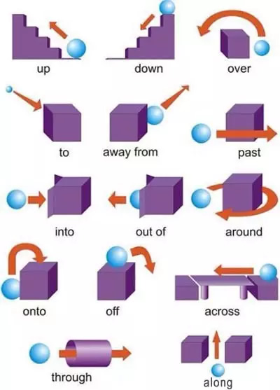
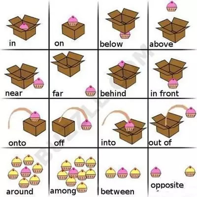
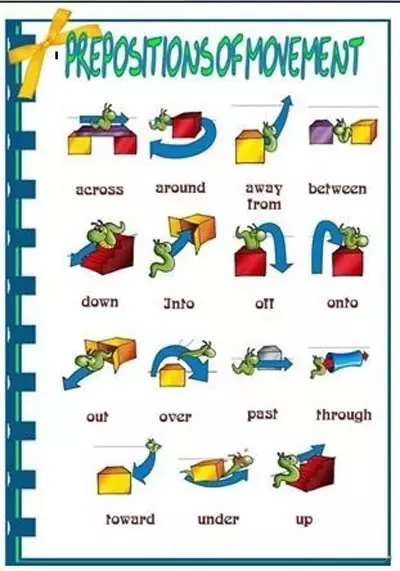
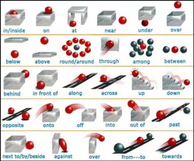
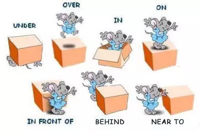
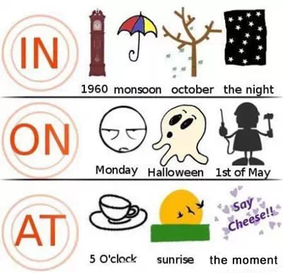
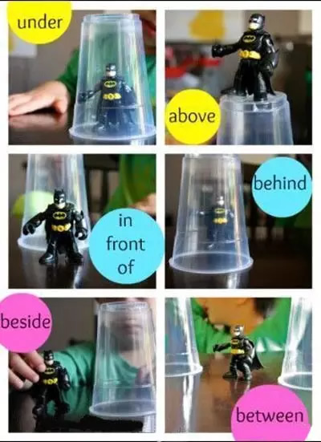
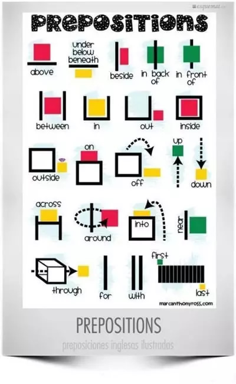
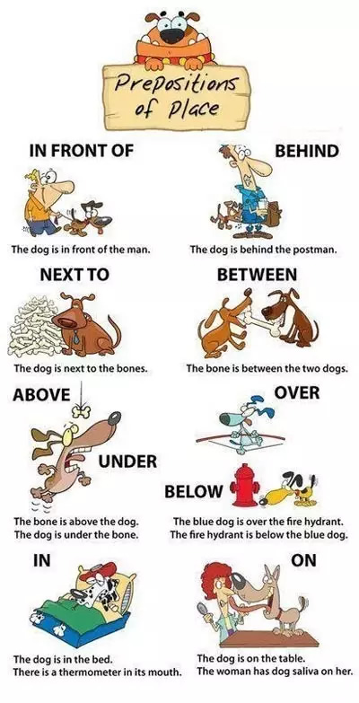

# 介词

## under

## after

## across

## near

## with

## over

## off

1. 一般指从上到下的离开，比如一只猫在桌子上，它跳到地板上然后走了，就叫 off。桌子比地板高，猫是从上到下走的

## onto

1. 一般指从下到上，比如一只猫在地板上，它跳到桌子上，就叫 onto。桌子比地板高，猫是从下到上。和 off 的意思相反

## along

## between

## into

1. 假设有一个箱子，一只狗在箱子外，狗进入这个箱子就叫 into。原本在外面的东西进入到里面叫 into

## out of

1. 假设有一个箱子，一只狗在箱子内，狗从这个箱子里走出来就叫 out of。原本在里面的东西出去到外面叫 out of。和 into 的意思相反

## beside

1. 相比 near 来说，beside 表达更近，可以理解为紧挨着 但 near 比较远一点 两个物体之间有间隔

## behind

## within

在（某段时间）之内

I eat 10 carrots within 5 minutes

## 介词图表

- 

  该图中 up 向上, 在上, 沿；down 向下；over （表示方向） 越过 ；to 到; 向，朝着；away from 远离；past 越过；into （表示方向） 进入…中； out of 从...出来， 自…离开；around 围绕，在…周围；onto 到…之上；off 从…落下；across 穿过，横过；through 通过，穿过；along 沿着。

- 

  该图中 in 在...里面；on 在...上面，接触；below 在....下面；above （表示位置） 在…正上方，不接触；near （表示位置） 靠近；far（表示位置） 靠远；behind （表示位置） 在…的后面；in front （表示位置） 在…的前面；onto 到…之上；off 从...落下；into 进入...里；out of 从...里出来；around 在…周围；among（表示位置） 处在…中；between 在....两者之间；opposite （表示位置） 在…的对面

- 

  该图中 across 穿过，横过；around 在…周围；away from 远离；between 在....两者之间；down 向下；into （表示方向） 进入…中；off 从...下来；onto 到…之上；out 从...里出来；over （表示方向） 越过 ；past 越过；through 通过，穿过；toward 接近；under 在…下面，在表面之下;up 向上。

- 

- 

  这张图主要说明位置介词 under 在…下面，在表面之下;over （部份或全部覆盖） 在…上面；in （表示位置） 在…里面;on （表示位置） 在…上；in front of 在…前面；behind 在...后面；near to 接近于，靠近于;

- 

  该图主要说明介词 in,on,at 表时间的用法，这三个介词的用法很容易混淆导致使用错误，通过该图可以一目了然的看到 in 1960 在某一年，in monsoon 在雨季；in october 在十月；in the night 在夜间,在夜里（某个时候），这些用介词 in。on Monday 在星期一(具体某一天用 on)；on halloween 在万圣节这天；on 1st of May 有 5 月 1 号这天，在某一天用 on。at 5 O'clock 在 5 点，at sunrise 在太阳升起的时候，at the moment 当时; 时刻，在某一时刻用介词 at。

- 

  该图简明的说明了在...之下，在...之上，在...前面，在...后面，在...一边，在...之间用什么介词。

- 

  该图通过几个图形简介的说明了介词 above,under,below,beneath,beside,in bock of ,in front of,between,in,out,inside,outside,on,of,up,down,across,around,into,near,through,for,with,first,last 所表达的意思。

- 

- **参考链接**<https://en-grammar.xiao84.com/201707/29125.html>
