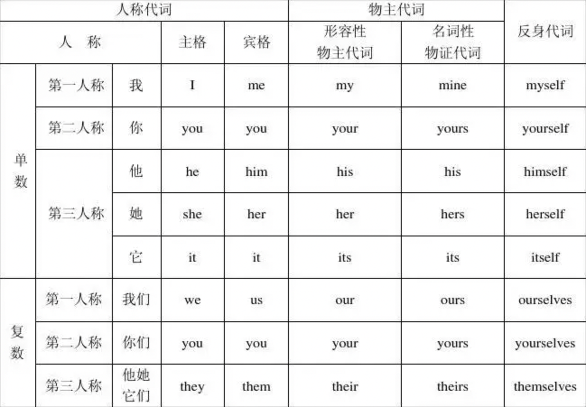

# 语法

### 主格和宾格

- **主格：在句子中充当主语的成分，放在动词前。如“我请你吃饭”中，“我”是主格**

- **宾格：在句子中充当宾语的成分，放在动词后面。如“小明给我一部手机”中，“我”是宾格**

- **主格的人称代词有：I、you、he、she、it、we、they**

- **宾格的人称代词有：me、you、him、her、it、us、them**

  ```
  Do you like me?   //you是主格，me是宾格
  你喜欢我吗？

  They don't want to go to work   //they是主格
  他们不想上班

  I asked him to drink water    //I是主格，him是宾格
  我请他喝水

  Please give us the fruit    //us是宾格,因为give是一个动词
  请把水果给我们

  Open the door for me    //me是宾格
  给我开门
  ```

### 人称代词

- **第一人称指说话人自己**

  - 单数 i

    ```
    I like listening to music
    我喜欢听音乐
    ```

  - 复数 we

    ```
    Where are we going?
    我们要去哪?
    ```

- **第二人称指说话的对象**

  - 单数 you

    ```
    Where are you going today?
    你今天要去哪？
    ```

  - 复数 you

    ```
    What do you eat?
    你们要吃什么？
    ```

- **第三人称指除了你我的其他人，如他、她、他们、它、它们**

  - 单数 he、she、it

    ```
    Did he get up today?
    他今天起床了吗？

    She looks beautiful today
    她今天很漂亮
    ```

  - 复数 they

    ```
    Are they all dog?
    它们都是狗吗？
    ```

### 人称代词表格



### this is 和 here is 的区别

- **this is 多用于介绍某人或者某物,强调的是事物本身**

  ```
  This is my teacher    //强调的是 teacher 这个人
  这是我的老师

  This is my house      //强调的是 house 这个房子
  这是我的房子
  ```

- **here is 一般用在半倒装句里起强调作用,或者把某物递给某人时所用的口语表述,here is 强调的是东西所在的位置**

  ```
  当你去排队检票时,对工作人员说 here is my ticket 这是我的票,这时强调的不是 '票',而是强调我手里的这张票,强调 '手里' 这个地点
  ```

  ```
   你是一个服务员,当客人来拿取饮料时,你一边把饮料递给客人一边可以说 here is your drinks 这是你的饮料,
  ```

- **this is 用在疑问句中**

  ```
  Is this your dog?
  这是你的狗吗?
  ```

- **this is 用在否定句中**

  ```
  This is not my dog
  这不是我的狗
  ```

- **here is 基本不用于否定句或者疑问句中**

### be,am,is,are 的使用

### a 和 an 的区别

- **都表示一个的意思**

- **以 a、e、i、o 开头的单词，用 an。否则就用 a**

```
I'm a teacher
我是一名老师

I'm an engineer
我是一名工程师
```

### his,her,my,their

### look 和 watch,see 的区别

- **look 通常表示主动地、有意识地"看"，侧重指看的行为**

```
I'm looking at picture
我在看照片
```

- **watch 也指有意识地看，但往往指仔细地盯着事物的变化**

```
I'm watching TV
我在看电视
```

- **see 看到,侧重看到的结果**

```
I see a dog in the window
我看到窗户里有条狗
```

- **总结**
  - 如果是将目光看向某物，用 look
  - 如果是眼睛单纯看到的事物,用 see
  - 如果是在一段时间内关注某些事物,像是一场比赛或者电视节目，用 watch
