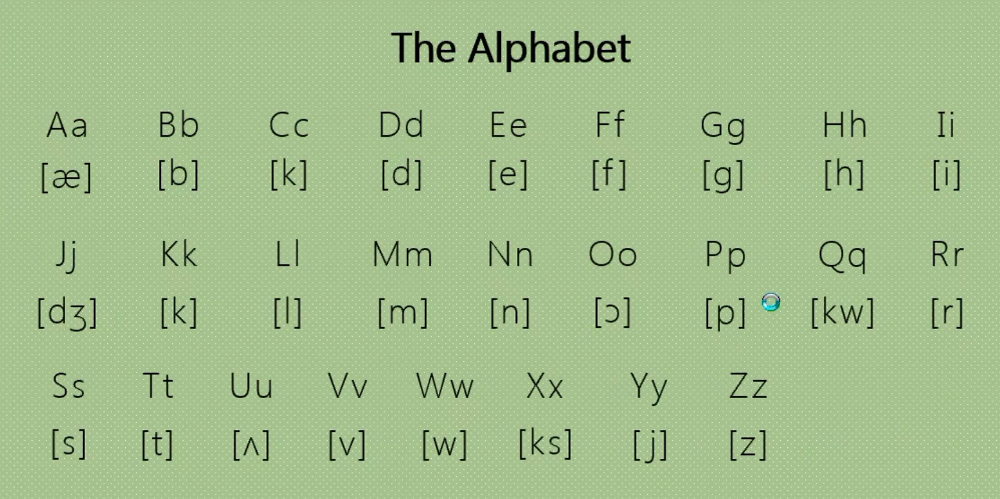

# 音标

## 音标对应字母

### ɪ

1. i

   - it **[ɪt]** 它

   - bit **[bɪt]** 小片;小块

   - big **[bɪɡ]** 大的;严重的

2. e

   - women **[ˈwɪmɪn]** 女人

   - delay **[dɪˈleɪ]** 延期;推迟

   - pretty **[ˈprɪti]** 漂亮的

   - ticket **[ˈtɪkɪt]** 票

3. u

   - busy **[ˈbɪzi]** 忙碌的

4. y

   - family **[ˈfæməli]** 家庭

   - city **[ˈsɪti]** 城市

5. ey

   - money **[ˈmʌni]** 钱;钞票

   - monkey **[ˈmʌŋki]** 猴子;淘气鬼

### iː

1. e

   - she **[ʃiː]** 她

2. ee

   - see **[siː]** 看见

3. ea

   - eat **[iːt]** 吃;吃饭

4. ei

   - ceiling **[ˈsiːlɪŋ]** 天花板

5. ey

   - key **[kiː]** 钥匙

6. ie

   - field **[fiːld]** 田;字段

### e

1. e

   - bed **[bed]** 床

   - pet **[pet]** 宠物

2. a

   - any **[ˈeni]** 任何的

3. ea

   - head **[hed]** 头

   - bread **[bred]** 面包

   - dead **[ded]** 死的；去世的

4. ai

   - said **[sed]** 说

5. ay

   - says **[sez]** 说

6. ie

   - friend **[frend]** 朋友

### æ

1. a

   - bag **[bæɡ]** 包；袋子

   - cat **[kæt]** 猫

   - ant **[ænt]** 蚂蚁

### ɑː

1. a

   - father **[ˈfɑːðə(r)]** 父亲

   - ask **[ɑːsk]** 询问

   - grass **[ɡrɑːs]** 草

2. ar

   - star **[stɑː(r)]** 星

   - card **[kɑːd]** 卡片

   - park **[pɑːk]** 公园

3. au

   - aunt **[ɑːnt]** 阿姨；姑妈

   - laugh **[lɑːf]** 笑

## 字母对应音标

- 参考链接<https://www.bilibili.com/video/BV1Lv411H79K?spm_id_from=333.999.0.0>

## 学习过程中经常碰到的

- `ch` 通常发 `[tʃ]`

- `sh` 通常发 `[ʃ]`

- `th` 通常发 `[θ]`

- `se` 通常发 `[z]`

- `le` 通常发 `[l]`

- `ou` 通常发 `[aʊ]`

- `ee` 通常发 `[iː]`

- `oo` 通常发 `[ruː]`

- `e` 在结尾通常不发音

- `tor` 在结尾通常发 `[tə]`

- `ce` 在结尾通常发 `[s]`
